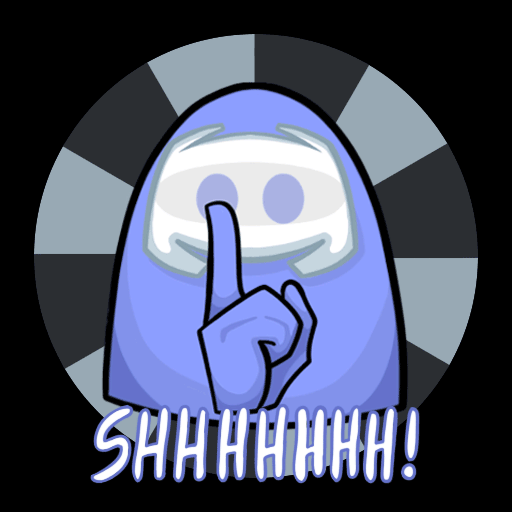

<p align="center">
    <a href="https://automute.us/#/" alt = "Website link"></a>
</p>
<p align="center">
    <a href="https://github.com/denverquane/amongusdiscord/actions?query=build" alt="Build Status">
        
    </a>
    <a href="https://github.com/denverquane/automuteus/releases/latest">
    
    </a>
    <a href="https://github.com/denverquane/amongusdiscord/graphs/contributors" alt="Contributors">
        
    </a>
    <a href="https://discord.gg/ZkqZSWF" alt="Discord Link">
        
    </a>
</p>
<p align="center">
    <a href="https://hub.docker.com/repository/docker/denverquane/amongusdiscord" alt="Pulls">
        
    </a>
    <a href="https://hub.docker.com/repository/docker/denverquane/amongusdiscord" alt="Stars">
        
    </a>
    <a href="https://goreportcard.com/report/github.com/denverquane/automuteus" alt="Report Card">
        
    </a>
</p>

<p align="center">
    <a href="https://discord.com/api/oauth2/authorize?client_id=753795015830011944&permissions=267746384&scope=bot" alt="invite">
        
    </a>
</p>

# AutoMuteUs

<div style="display: flex; align-item: center; justify: center;">
<p style="">
    <a href="https://discord.com/api/oauth2/authorize?client_id=753795015830011944&permissions=267746384&scope=bot"/>
        
    </a>
</p>
<div style="margin-left: 2%">
AutoMuteUs is a Discord Bot to harness Among Us game data, and automatically mute/unmute players during games!

Requires [amonguscapture](https://github.com/denverquane/amonguscapture) to capture and relay game data.

Have any questions, concerns, bug reports, or just want to chat? Join our discord at https://discord.gg/ZkqZSWF!

Click the "invite me" badge in the header to invite the bot to your server, or click the GIF on the left.

All artwork for the bot has been generously provided by <a href=https://aspen-cyborg.tumblr.com/>Smiles</a>!


</div>
</div>

# ⚠️ Requirements ⚠️

1. You **must** run the [Capture application](https://github.com/denverquane/amonguscapture/releases/latest) on your Windows PC for the bot to work! Any Among Us games that don't have a user running the capture software will **not have automuting capabilities**!
2. The [Capture application](https://github.com/denverquane/amonguscapture/releases) currently only supports the **Non-Beta Official Steam** release of the game.

# Quickstart and Demo (click the image):

[](https://youtu.be/kO4cqMKV2yI)

# Usage and Commands

To start a bot game in the current channel, type the following `.au` command in Discord after inviting the bot:

```
.au new
# Starts a game, and allows users to react to emojis to link to their in-game players
```

The bot will send you a private message (make sure your Discord settings allow DMs from server members!) with a link that is used to sync the capture software to your game. It will also have a link to download the latest version of the capture software, if you don't have it already.

If you want to view command usage or see the available options, type `.au` or `.au help` in your Discord channel.

## Commands

The Discord Bot uses the `.au` prefix for any commands by default; if you change your prefix remember to replace `.au` with your custom prefix. If you forget your prefix, you can @mention the bot and it will respond with whatever it's prefix currently is.

| Command        | Alias   | Arguments   | Description                                                                                                     | Example                            |
| -------------- | ------- | ----------- | --------------------------------------------------------------------------------------------------------------- | ---------------------------------- |
| `.au help`     | `.au h` | None        | Print help info and command usage                                                                               |                                    |
| `.au new`      | `.au n` | None        | Start a new game in the current text channel. Optionally accepts the room code and region                       | `.au n CODE eu`                    |
| `.au link`     | `.au l` | @name color | Manually link a discord user to their in-game color                                                             | `.au l @Soup cyan`                 |
| `.au refresh`  | `.au r` | None        | Remake the bot's status message entirely, in case it ends up too far up in the chat.                            |                                    |
| `.au end`      | `.au e` | None        | End the game entirely, and stop tracking players. Unmutes all and resets state                                  |                                    |
| `.au unlink`   | `.au u` | @name       | Manually unlink a player                                                                                        | `.au u @player`                    |
| `.au settings` | `.au s` |             | View and change settings for the bot, such as the command prefix or mute behavior                               |                                    |
| `.au pause`    | `.au p` | None        | Pause the bot, and don't let it automute anyone until unpaused. **will not un-mute muted players, be careful!** |                                    |
| `.au privacy`  |         |             | View privacy and data collection information about the bot                                                      |                                    |
| `.au info`     | `.au i` | None        | View general info about the Bot                                                                                 |                                    |
| `.au map`      |         | MAPNAME     | View an image of an in-game map in the text channel. Two supported versions: simple or detailed(vent, camera, etc) | `.au map skeld detailed` |

_In addition to handful of more secretive Easter Egg commands..._

# Privacy

You can view privacy and data collection details for the Official Bot [here](PRIVACY.md).

# Localization

View details on Localization and Multi-Language support [here](LOCALIZATION.md).

# Self-Hosting

If you would prefer to self-host the bot, the steps for doing so are provided below.
Self-hosting requires robust knowledge and troubleshooting capability for Docker/Docker-compose, unRAID, Heroku, and/or any other networking and routing config specific to your hosting solution.

As such, **we recommend that the majority of users take advantage of our Verified bot**. The link to invite our bot can be found here:

<a href="https://discord.com/api/oauth2/authorize?client_id=753795015830011944&permissions=267746384&scope=bot" alt="invite">
        
    </a>

If you are certain that you would prefer to self-host the bot, please follow any of the guides detailed below.

## Pre-Installation Steps, Important!

- Create an Application and Bot account (requires Admin privileges on the Server in question). [Instructions here](BOT_README.md)

Now follow any of the specific hosting options provided below:

## Docker Compose:

Docker compose is the simplest and recommended method for self-hosting AutoMuteUs, but it does require an existing physical machine or VPS to run on.

There is a [`docker-compose.yml`](docker-compose.yml) file in this repository that will provide all the constituent components to run AutoMuteUs.

### Steps:

- Install [Docker](https://docs.docker.com/engine/install/) and [Docker Compose](https://docs.docker.com/compose/install/) on the machine you will be using to host AutoMuteUs
- Download the [`docker-compose.yml`](docker-compose.yml) from this repository, and create a `.env` file in the same directory that will contain your Environment Variables. On Linux/UNIX systems you can use `touch .env` to create this file, but a template [`sample.env`](sample.env) is provided in this repository for reference. 
- Provide your specific Environment Variables in the `.env` file, as relevant to your configuration. Please see the Environment Variables reference further down in this Readme for details, as well as the [`sample.env`](sample.env) provided.
- Run `docker-compose pull`. This will download the latest built Docker images from Dockerhub that are required to run AutoMuteUs.
- Run `docker-compose up -d` to start all the containers required for AutoMuteUs to function. The containers will now be running in the background, but you can view the logs for the containers using `docker-compose logs`, or `docker-compose logs -f` to follow along as new log entries are generated.

## unRAID

unRAID hosting steps are are not yet updated for v3.0+ of AutoMuteUs, and as such is not supported at this time.

## Heroku

Heroku hosting steps are are not yet updated for v3.0+ of AutoMuteUs, and as such is not supported at this time.

## FreeBSD

AutoMuteUs exists in the FreeBSD Ports tree as [`games/automuteus`](https://www.freshports.org/games/automuteus/). Instructions are included in the Port.

## Old version
If, for whatever reason, you _really_ want to self host, but also don't want to figure out Docker or use Windows and hate Docker because of it (I don't blame you) you can self host [2.4.3](https://github.com/denverquane/automuteus/releases/tag/2.4.3) instead. **If you are using this method, continue using the newest capture!**

## Development Instructions
The easiest way to test changes is to use docker-compose, but instead of using a pre-built image, building the automuteus docker image from source. Thankfully, this is easy to do:

1. In the `docker-compose.yml` comment out the line `image: denverquane/amongusdiscord:${AUTOMUTEUS_TAG:?err}` and uncomment the `build .` line.
2. Make any changes to the code or sql file that you would like.
3. Use the command `docker-compose build` to build the set of docker images with your change
4. Start the stack with `docker-compose up`

Just remember that you will need to do a rebuild of the docker images every time you make a change.

## Environment Variables

### Required

- `DISCORD_BOT_TOKEN`: The Bot Token used by the bot to authenticate with Discord.
- `REDIS_ADDR`: The host and port at which your Redis database instance is accessible. Ex: `192.168.1.42:6379`
- `POSTGRES_ADDR`: Address (host:port) at which Postgres is accessible. Used by automuteus to store game statistics. 
- `POSTGRES_USER`: Username for authentication with Postgres.
- `POSTGRES_PASS`: Password for authentication with Postgres.
- `GALACTUS_ADDR`: Address at which Galactus is accessible. Typically something like `http://localhost:5858` (or see docker-compose.yml)

### Optional

- `WORKER_BOT_TOKENS`: A comma-separated list of extra tokens to be used for mute/deafen. (Sent to Galactus, and stored in Redis after first start-up)
- `EMOJI_GUILD_ID`: If your bot is a member of multiple guilds, this ID can be used to specify the single guild that it should use for emojis (no need to add the emojis to ALL servers).
- `HOST`: The **externally-accessible URL** for Galactus. For example, `http://test.com:8123`.
  This is used to provide the linking URI to the capture, via the Direct Message the bot sends you when typing `.au new`.
  **You must specify `http://` or `https://` accordingly, and specify the port if non-8123. For example, `https://your-app.herokuapp.com:443`**
- `LOCALE_PATH`: Path to localization files.
- `LOG_PATH`: Filesystem path for log files. Defaults to `./`
- `CAPTURE_TIMEOUT`: How many seconds of no capture events received before the Bot will terminate the associated game/connection. Defaults to 36000 seconds.
- `REDIS_PASS`: Your Redis database password, if necessary.
- `AUTOMUTEUS_LISTENING`: What the bot displays it is "Listening to" in the online presence message. Recommend putting your custom command prefix here
- `AUTOMUTEUS_GLOBAL_PREFIX`: A universal default for the bot's command prefix. The bot will respond to **both** this prefix, and any guild-specific prefixes set in settings.

### HIGHLY advanced. Probably don't ever touch these!

- `NUM_SHARDS`: Num shards provided to the Discord API.
- `SHARD_ID`: Shard ID used to identify with the Discord API. Needs to be strictly less than `NUM_SHARDS`

## Galactus

Galactus is a program used to speed up muting and deafening (which is typically constrained by Discord rate-limits). It allows for an arbitrary number of tokens to be provided for faster muting/deafening, but also supports capture-side bots.
A guide to setup your own capture-side bot can be found [here,](https://youtu.be/jKcEW5qpk8E) and the repo for Galactus is [here.](https://github.com/automuteus/galactus)

# Similar Projects

- [Imposter](https://github.com/molenzwiebel/Impostor): Similar bot that uses private Discord channels instead of mute/deafen. Also uses a dummy player joining the game and "spectating" to get game information; no capture needed (although loses the 10th player slot).

- [AmongUsBot](https://github.com/alpharaoh/AmongUsBot): Without their original Python program
  with a lot of the OCR/Discord functionality, I never would have even thought of this idea! **Not currently maintained**

- [amongcord](https://github.com/pedrofracassi/amongcord): A great program for tracking player status and auto mute/unmute in Among Us.
  Their project works like a traditional Discord bot; very easy installation!

- [Silence Among Us](https://github.com/tanndev/silence-among-us#silence-among-us): Another bot quite similar to this one, which also uses AmongUsCapture. Now in early-access with a publicly-hosted instance!
