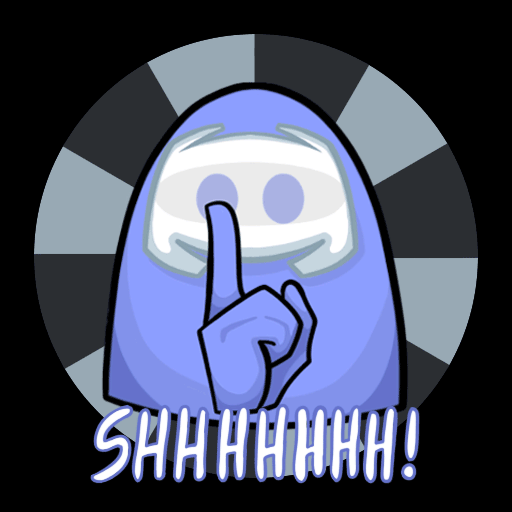

<p align="center">
    <a href="https://automute.us/#/" alt = "Website link"></a>
</p>
<p align="center">
    <a href="https://github.com/automuteus/automuteus/actions?query=build" alt="Build Status">
        
    </a>
    <a href="https://codecov.io/gh/automuteus/automuteus" alt="Code Coverage">
        
    </a>
    <a href="https://github.com/automuteus/automuteus/releases/latest">
    
    </a>
    <a href="https://github.com/automuteus/automuteus/graphs/contributors" alt="Contributors">
        
    </a>
    <a href="https://discord.gg/ZkqZSWF" alt="Discord Link">
        
    </a>
</p>
<p align="center">
    <a href="https://hub.docker.com/repository/docker/automuteus/automuteus" alt="Pulls">
        
    </a>
    <a href="https://automuteus.crowdin.com/automuteus" alt="localize">
        
    </a>
</p>

<p align="center">
    <a href="https://add.automute.us" alt="invite">
        
    </a>
</p>

# AutoMuteUs

<div style="display: flex; align-item: center; justify: center;">
<p style="">
    <a href="https://add.automute.us"/>
        
    </a>
</p>
<div style="margin-left: 2%">
AutoMuteUs is a Discord Bot to harness Among Us game data, and automatically mute/unmute players during games!

Requires [amonguscapture](https://github.com/automuteus/amonguscapture) to capture and relay game data.

Have any questions, concerns, bug reports, or just want to chat? Join our discord at https://discord.gg/ZkqZSWF!

Click the "invite me" badge in the header to invite the bot to your server, or click the GIF on the left.

All artwork for the bot has been generously provided by <a href=https://aspen-cyborg.tumblr.com/>Smiles</a>!


</div>
</div>

# ⚠️ Requirements ⚠️

1. You **must** run the [Capture application](https://github.com/automuteus/amonguscapture/releases/latest) on your
   Windows PC for the bot to work! Any Among Us games that don't have a user running the capture software will **not
   have automuting capabilities**!
2. The [Capture application](https://github.com/automuteus/amonguscapture/releases) currently only supports the Steam,
   Epic Games, itch.io, and Microsoft Store releases of the game, but **does not** support beta or cracked versions.

# Quickstart and Demo (click the image):

[](https://youtu.be/VYx6kM1O4FM)

# Usage and Commands

To start a bot game in the current channel, type the following slash command in Discord after inviting the bot:

```
/new
# Starts a game, and allows users to react to emojis to link to their in-game players
```

The bot will send you a private reply with a link that is used to sync the capture software to your game. It will also have a link to download the latest version of the capture software, if you don't have it already.

If you want to view command usage or see the available options, type `/help` in your Discord channel.

## Commands

| Command     | Description                                                                                                            | Example                  |
|-------------|------------------------------------------------------------------------------------------------------------------------|--------------------------|
| `/help`     | Print help info and command usage                                                                                      |                          |
| `/new`      | Start a new game in the current text channel                                                                           |                          |
| `/refresh`  | Remake the bot's status message entirely, in case it ends up too far up in the chat.                                   |                          |
| `/pause`    | Pause the bot, and don't let it automute anyone until unpaused.                                                        |                          |
| `/end`      | End the game entirely, and stop tracking players. Unmutes all and resets state                                         |                          |
| `/link`     | Manually link a discord user to their in-game color                                                                    | `/link @Soup cyan`       |
| `/unlink`   | Manually unlink a player                                                                                               | `/unlink @Soup`          |
| `/settings` | View and change settings for the bot, such as the command prefix or mute behavior                                      |                          |
| `/privacy`  | View privacy and data collection information about the bot                                                             |                          |
| `/info`     | View general info about the Bot                                                                                        |                          |
| `/map`      | View an image of an in-game map in the text channel. Provide the name of the map, and if you want the detailed version | `/map skeld true`        |
| `/stats`    | View detailed stats about Among Us games played on the current server, or by a specific player                         | `/stats user view @Soup` |
| `/premium`  | View information about AutoMuteUs Premium, and the current premium status of your server                               |                          |

# Privacy

You can view privacy and data collection details for the Official Bot [here](PRIVACY.md).

# Localization

AutoMuteUs now uses [CrowdIn](https://crowdin.com/) for Localization and translations (thanks @MatadorProBr)!

Help us translate the bot here:

[](https://automuteus.crowdin.com/automuteus)

To prepare any new strings for translation, first install goi18n v2.1.1 using the following command:
```
go install -v github.com/nicksnyder/go-i18n/v2/goi18n@v2.1.1
```

Then run the following command anytime new strings or translations are added:

```
goi18n extract -outdir locales
```

# Self-Hosting

Self-hosting requires robust knowledge and troubleshooting capability for Docker/Docker-compose, unRAID, Heroku, and/or any other networking and routing config specific to your hosting solution.

As such, **we recommend that the majority of users take advantage of our Verified bot**. The link to invite our bot can
be found here:

<a href="https://add.automute.us" alt="invite">
        
    </a>

If you are certain that you would prefer to self-host the bot, please follow any of the instructions on [automuteus/deploy](https://github.com/automuteus/deploy).

# Developing

Please refer to the instructions on [automuteus/deploy](https://github.com/automuteus/deploy).

## Repository layout

This repository builds three service binaries:

* **AutoMuteUs** (`main.go`): the Discord bot itself. Published as `automuteus/automuteus` on Docker Hub.
* **Galactus** (`cmd/galactus`): the socket.io broker that capture clients connect to. It relays game events to
  the bot over Redis, so the bot can be upgraded or restarted without severing capture connections. Published as
  `automuteus/galactus` on Docker Hub (`Dockerfile.galactus`).
* **API** (`cmd/api`): HTTP endpoints for the website, settings, game state, and capture links.
  Published as `automuteus/api` (`Dockerfile.api`), using the same release tag and commit as the bot and Galactus.

```sh
go build .               # bot
go build ./cmd/galactus  # broker
go build ./cmd/api       # HTTP API
```

### Upgrading: standalone API

The bot no longer serves HTTP on port 5000. Run the new API image against the
same Redis and Postgres instances, and route existing API traffic to it. It needs
no Discord bot token or gateway connection. Routes and Basic Auth are unchanged.
`/bot/info` reports the API build's version/commit and the shared guild, game and
user counts. It no longer includes `shardID` or `shardCount`, since the API is not
tied to a shard; the bot's `/info` Discord command continues to describe its own shard.

Start the API, verify `/ready`, and switch the API Service/reverse proxy before
rolling out bot images that remove the embedded API. Compose users should update
the sibling `deploy` repository, stop the old bot container to release its public
port, then recreate the stack; the existing public `API_PORT` mapping now belongs
to the `api` service. Use a release that publishes
all three images. The API and bot can initialize a fresh self-hosted database in
either order; schema application is serialized and idempotent. Official mode
continues to expect an existing statistics schema.

The API uses the same guild-settings reader as the bot, including lazy migration
of old Redis records. Game state is returned directly from the shared Redis JSON.
Bot health checks and Prometheus endpoints remain on the bot.

### API environment variables

| Variable | Required | Description |
|----------|----------|-------------|
| `REDIS_ADDR` | yes | Shared Redis address, using DB 0. |
| `REDIS_USER`, `REDIS_PASS` | no | Redis credentials, when applicable. |
| `POSTGRES_ADDR`, `POSTGRES_USER`, `POSTGRES_PASS` | yes | Shared Postgres connection settings. |
| `API_PORT` | no | Executable's listening port; defaults to `5000`. Compose maps its host `API_PORT` to container `SERVICE_PORT`. |
| `API_SERVER_URL` | no | Public API URL for Swagger; defaults to `http://localhost`. Also retain this on bots for capture links. |
| `API_ADMIN_PASS` | no | Basic Auth password for user `admin`; defaults to `automuteus`. Raising or clearing platform notices requires a non-default value. |
| `LOG_FORMAT`, `LOG_LEVEL` | no | `text` (default) or `json`; `debug`, `info` (default), `warn`, or `error`. Shared by the bot, API, and Galactus. |
| `HOST` | no | Public Galactus URL for capture links; defaults to `http://localhost:8123`. |
| `AUTOMUTEUS_OFFICIAL` | no | Same presence-based official mode as the bot; must match the bot deployment. |

`/live` checks the API process; `/ready` checks Redis and Postgres. Both are served
on the API port. The process drains HTTP requests on SIGTERM/SIGINT.

### Bot metrics

Each bot process serves Prometheus metrics at `/metrics` on port `2112`. Every metric
measures activity across the shards in that process, starts at zero, and resets when the
process restarts. Prometheus supplies the `job` and `instance` labels when scraping each
replica directly. Labels are fixed, small sets; guild IDs, user IDs, connect codes, and
error text stay in the logs.

Voice changes:

- `automuteus_voice_changes_total{route, outcome}`: the final outcome for each user in a
  mute/deafen batch, after fallbacks. `route` is `worker` (premium worker token),
  `capture` (the capture client's own token), or `primary` (the bot's token);
  `outcome` is `applied` or `failed`. Only the primary route can be the final failure.
- `automuteus_worker_voice_failures_total`: worker-token attempts that failed and fell
  back to another route.
- `automuteus_capture_mute_tasks_total{result}`: tasks handed to capture clients.
  `applied` was acknowledged, `throttled` was withheld by the bot to protect the client's
  rate limit, `unacked` timed out (and blacklisted the client), and `error` could not be
  sent. Games with no capture client able to mute are not counted here at all; that is a
  normal condition.
- `automuteus_mute_batch_duration_seconds`: histogram of wall time per mute/deafen batch.

Games:

- `automuteus_active_games`: games whose capture events this process is subscribed to.
- `automuteus_games_started_total`: games started with `/new`.
- `automuteus_games_ended_total{reason}`: `manual` (`/end`), `replaced` (`/new` over an
  existing game), `inactivity` (capture went quiet), `capture_shutdown`,
  `critical_notice`, or `other`.
- `automuteus_game_cleanup_failures_total{step}`: end-of-game steps that failed:
  `unmute` (players may have been left muted), `record_match` (match not marked aborted),
  or `notify` (end-of-game message not posted).

Message activity, `automuteus_discord_operations_total{type}`, is a set of coarse
counters: `message_create_delete`, `message_edit`, and `rate_limited`. These reflect
existing instrumentation (message edits are counted when scheduled, for example) and are
not an exact HTTP request or successful-response count. `rate_limited` counts only
rate-limit responses reported by Discord to the primary session; the bot's own capture
throttling is reported under `automuteus_capture_mute_tasks_total{result="throttled"}`
instead. Go runtime and process metrics are also exposed by the default Prometheus
registry.

Recording metrics uses in-memory counters and makes no Redis requests. This replaces
`discord_requests_by_node_and_type` and its `nodeID` label; `SCW_NODE_ID` is no longer
used. The derived `official_request` category is removed, `invalid_request` is renamed
to `rate_limited`, and the `mute_deafen_official`, `mute_deafen_worker`, and
`mute_deafen_capture` types are replaced by `automuteus_voice_changes_total`. Old
`automuteus:requests:type:*` Redis counters are no longer read or updated. Capture clients' own Discord requests, and the bot's HTTP traffic in
general, are not yet measured. A metrics scraper and dashboards are not bundled with the
bot yet.

### Platform notices

Operators can show a banner on every running game's status message, or end every
game, through `/admin/notice` (Basic Auth as `admin`, non-default `API_ADMIN_PASS`):

```sh
# warn players; games keep running; the banner stays until you DELETE the notice
curl -u admin:$API_ADMIN_PASS -X POST $API/admin/notice \
  -H 'Content-Type: application/json' \
  -d '{"severity":"warning","message":"Database maintenance in progress; expect some lag."}'

# end every running game (players are unmuted, matches recorded as aborted) and block /new until cleared
curl -u admin:$API_ADMIN_PASS -X POST $API/admin/notice \
  -H 'Content-Type: application/json' \
  -d '{"severity":"critical","message":"AutoMuteUs is going down for maintenance."}'

curl -u admin:$API_ADMIN_PASS $API/admin/notice            # show the active notice
curl -u admin:$API_ADMIN_PASS -X DELETE $API/admin/notice  # clear it
```

Galactus announces its own shutdown on SIGTERM, naming the games whose capture
clients were connected to that replica, so rolling restarts only end the games
that actually lose their capture connection; no notice is raised. Preview how the banners look
in a channel of your choice without running the bot:

```sh
go run ./cmd/embedpreview -webhook <discord webhook url> -severity warning -message "Expect some lag"
```

Regenerate Swagger documentation with the generator matching the Go dependency:

```sh
CGO_ENABLED=0 go run github.com/swaggo/swag/cmd/swag@v1.16.6 init -g cmd/api/main.go -o docs --parseDependency --parseInternal
```

### Upgrading: guild settings moved from Redis to Postgres

Guild settings are now stored in Postgres instead of Redis. No manual step is
needed: each guild's settings are moved the first time the new version reads
them. Guilds that are never read again can be moved with the optional sweep in
`cmd/migrate-guild-settings`. See
[storage/GUILD_SETTINGS_MIGRATION.md](storage/GUILD_SETTINGS_MIGRATION.md).

### Galactus environment variables

| Variable      | Required | Description                                                                   |
|---------------|----------|-------------------------------------------------------------------------------|
| `REDIS_ADDR`  | yes      | Address of the Redis instance shared with the bot.                            |
| `BROKER_PORT` | no       | Port to listen on for capture-client socket connections. Defaults to `8123`.  |
| `REDIS_USER`  | no       | Username to authenticate with Redis, if applicable.                           |
| `REDIS_PASS`  | no       | Password to authenticate with Redis, if applicable.                           |
| `DRAIN_SECONDS` | no     | Seconds to keep serving after SIGTERM, refusing new capture clients, before telling the bots to end this replica's games. Defaults to `5`. Keep well under the orchestrator's termination grace period. |
| `LOG_FORMAT`, `LOG_LEVEL` | no | Same logging switches as the bot and API. |

`/` is the liveness endpoint. `/ready` returns 503 from the moment Galactus receives
SIGTERM, so point readiness probes at it to stop routing new capture clients to a
replica that is shutting down. The container runs the binary as PID 1 (exec-form
`ENTRYPOINT`) so the signal is delivered directly; keep it that way.

### Capture mock development client

Run `go run ./cmd/capture-mock` to send simulated capture events to Galactus.
Paste a connect code or capture link from `/new`, then send lobby, phase, player,
and gameover events interactively. See [the capture mock guide](cmd/capture-mock/README.md)
for connection settings and usage.

# Similar Projects

- [Imposter](https://github.com/molenzwiebel/Impostor): Similar bot that uses private Discord channels instead of mute/deafen. Also uses a dummy player joining the game and "spectating" to get game information; no capture needed (although loses the 10th player slot).

- [AmongUsBot](https://github.com/alpharaoh/AmongUsBot): Without their original Python program
  with a lot of the OCR/Discord functionality, I never would have even thought of this idea! **Not currently maintained**

- [amongcord](https://github.com/pedrofracassi/amongcord): A great program for tracking player status and auto mute/unmute in Among Us.
  Their project works like a traditional Discord bot; very easy installation!

- [Silence Among Us](https://github.com/tanndev/silence-among-us#silence-among-us): Another bot quite similar to this one, which also uses AmongUsCapture. Now in early-access with a publicly-hosted instance!
